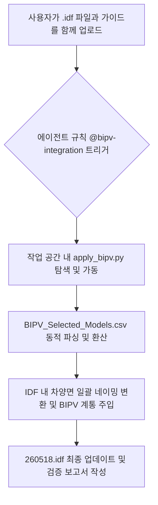

# BIPV 시스템 설정 및 자동화 가이드 (96개 차양 장치 연동 및 자동 연동 버전)

이 문서는 `260518.idf` 파일 내에 정의된 **96개의 동적/고정 차양 장치(Shading:Building:Detailed)**를 고효율 **BIPV(건물일체형 태양광) 발전 모듈**로 일괄 자동 변환하고 전력 계통에 통합 연계하기 위한 물리 사양, 수치 환산 이론 및 에이전트 자동화 실행 절차를 정리합니다.

---

📋 참조 에셋:
| 파일 | 타입 | 적용 내용 |
|------|------|----------|
| @python-uv | rule | 파이썬 스크립트 실행 시 uv run 명령어 사용 규칙 준수 |
| @bipv-integration | rule | IDF 파일 및 CSV 사양 감지 시 BIPV 시스템 자동 통합 규칙 적용 |

---

## 1. BIPV 발전기 정의 및 계통 연계 (Generator:Photovoltaic & ELC)

EnergyPlus 환경에서 독립된 차양 장치(Shading Surface)를 태양광 발전기로 기능하게 하려면 개별 발전기 객체(`Generator:Photovoltaic`)를 매핑하고, 생산된 전력을 취합하여 배전하는 시스템(`ElectricLoadCenter`)에 계통 연계(AC) 방식으로 연결해야 합니다.

### 1.1 계통 및 배전 통합 설정 (ElectricLoadCenter)
*   **배전 방식**: DC/AC 인버터 일체형 배선 방식(`DirectCurrentWithInverter`)을 채택하여 발전량에 인버터 효율(96%)을 정밀 반영한 최종 교류(AC) 전력으로 변환합니다.
*   **운영 체계**: 생산된 모든 전력을 기저부하(Baseload)로 즉시 소비하는 방식을 구현합니다.

```idf
! --- Electric Load Center Distribution ---
ElectricLoadCenter:Distribution,
  PV_System_ELC,           !- Name
  PV_List,                 !- Generator List Name
  Baseload,                !- Generator Operation Scheme Type
  0,                       !- Generator Demand Limit Scheme Purchased Electric Demand Limit {W}
  ,                        !- Generator Track Schedule Name
  ,                        !- Generator Track Scheme Modulating Scheme Name
  DirectCurrentWithInverter, !- Electrical Bussing Type
  Main_Inverter;           !- Inverter Name

! --- Electric Load Center Generators List ---
ElectricLoadCenter:Generators,
  PV_List,                 !- Name
  Shade_1_Gen, Generator:Photovoltaic, 250.0, , 0.0,
  Shade_2_Gen, Generator:Photovoltaic, 250.0, , 0.0,
  ...
  Shade_96_Gen, Generator:Photovoltaic, 250.0, , 0.0;

! --- Simple Inverter (96% Efficiency) ---
ElectricLoadCenter:Inverter:Simple,
  Main_Inverter,           !- Name
  ,                        !- Availability Schedule Name
  ,                        !- Zone Name
  0.0,                     !- Radiative Fraction
  0.96;                    !- Efficiency
```

### 1.2 개별 PV 발전기 매핑 (96개 차양 장치)
각 차양 장치 표면에 PV 모듈을 결합하여 동적으로 기하학적 일사량을 계산하고 발전할 수 있도록 `Generator:Photovoltaic` 객체를 생성합니다. 열교 계산 오류 및 시뮬레이션 솔버 수렴 실패를 방지하기 위해 **Decoupled 모드**로 결합합니다.

```idf
! --- Generator:Photovoltaic Definition Example ---
Generator:Photovoltaic,
  Shade_1_Gen,             !- Name
  Shade_1,                 !- Surface Name
  PhotovoltaicPerformance:EquivalentOne-Diode, !- Performance Object Type
  Shinsung_SolarSkin_250W_Performance, !- Performance Object Name
  Decoupled,                !- Heat Transfer Integration Mode
  1.0,                      !- Parallel Modules
  1.0;                      !- Series Modules
...
Generator:Photovoltaic,
  Shade_96_Gen,            !- Name
  Shade_96,                !- Surface Name
  PhotovoltaicPerformance:EquivalentOne-Diode, !- Performance Object Type
  Shinsung_SolarSkin_250W_Performance, !- Performance Object Name
  Decoupled,                !- Heat Transfer Integration Mode
  1.0,                      !- Parallel Modules
  1.0;                      !- Series Modules
```

---

## 2. BIPV 모듈 성능 사양 정의 및 환산 (PhotovoltaicPerformance:EquivalentOne-Diode)

신성 E&G의 고유 컬러 유리 BIPV 모듈인 **SolarSkin White (250W)**의 사양서 사양을 EnergyPlus의 5파라미터 다이오드 모델(`EquivalentOne-Diode`) 입력 포맷으로 물리 환산하여 적용합니다.

### 2.1 적용 모듈 사양 정보 (Shinsung SolarSkin 250W)
- **제조사/모델**: Shinsung E&G SolarSkin White (250W)
- **활성 면적 ($A_c$)**: $2.38\text{ m}^2$ (사양서 면적 그대로 대입)
- **주요 전기 사양**: $I_{sc} = 6.91\text{ A}$, $V_{oc} = 45.90\text{ V}$, $I_{mp} = 6.33\text{ A}$, $V_{mp} = 39.50\text{ V}$, $NOCT = 45.0^\circ\text{C}$

### 2.2 고정밀 5파라미터 수치 환산 이론

#### ① 직렬 셀 개수 ($N_s$) 보정
*   **배경**: 사양서 상 물리 셀 개수는 132개(Half-cut 셀)입니다.
*   **수렴 보정**: 하프컷 모듈은 전기적으로 2개의 병렬 스트링(각 66셀 직렬)으로 작동하므로, 5파라미터 물리 방정식 해석 시 $N_s = 66$으로 보정 대입해야 솔버의 수치 발산(numerical divergence) 및 비정상 전압 계산 오류가 발생하지 않습니다.
*   **보정 공식**:
    $$N_{s,\text{adjusted}} = \frac{N_{s,\text{STC}}}{2} = 66$$

#### ② 온도 계수 단위 변환
*   EnergyPlus는 단락 전류와 개로 전압의 온도 상승에 따른 증감량 단위를 절대 물리 단위($A/K$, $V/K$)로 요구합니다. 제조업체가 제공하는 백분율 비율($\%/K$) 값을 수식을 통해 매핑 환산해야 합니다.
*   **단락 전류 온도 계수 ($\alpha_{Isc}$)**:
    $$\text{TempCoeff\_Isc\_A\_K} = I_{sc,STC} \times \frac{\alpha_{Isc,\%}}{100} = 6.91 \times \frac{0.06}{100} = \mathbf{0.004146\text{ A/K}}$$
*   **개로 전압 온도 계수 ($\beta_{Voc}$)**:
    $$\text{TempCoeff\_Voc\_V\_K} = V_{oc,STC} \times \frac{\beta_{Voc,\%}}{100} = 45.90 \times \frac{-0.30}{100} = \mathbf{-0.1377\text{ V/K}}$$

### 2.3 EnergyPlus 성능 정의 객체 (IDF)
```idf
PhotovoltaicPerformance:EquivalentOne-Diode,
  Shinsung_SolarSkin_250W_Performance, !- Name
  CrystallineSilicon,      !- Cell type
  66,                      !- Number of Cells in Series (하프컷 132셀 전기적 66셀 보정 완료)
  2.38,                    !- Active Area {m2} (CSV A_c)
  0.85,                    !- Transmittance Absorptance Product (Stabilized)
  1.12,                    !- Semiconductor Bandgap {eV}
  500.0,                   !- Shunt Resistance {ohms}
  6.91,                    !- Short Circuit Current {A} (CSV Isc)
  45.90,                   !- Open Circuit Voltage {V} (CSV Voc)
  25,                      !- Reference Temperature {C}
  1000,                    !- Reference Insolation {W/m2}
  6.33,                    !- Module Current at Maximum Power {A} (CSV Ipmax)
  39.50,                   !- Module Voltage at Maximum Power {V} (CSV Vpmax)
  0.004146,                !- Temperature Coefficient of Short Circuit Current {A/K} (환산 완료)
  -0.1377,                 !- Temperature Coefficient of Open Circuit Voltage {V/K} (환산 완료)
  20,                      !- Nominal Operating Cell Temperature Test Ambient Temperature {C}
  45.0,                    !- Nominal Operating Cell Temperature Test Cell Temperature {C} (CSV NOCT)
  800,                     !- Nominal Operating Cell Temperature Test Insolation {W/m2}
  80.0,                    !- Module Heat Loss Coefficient {W/m2-K}
  50000;                   !- Total Heat Capacity {J/m2-K}
```

---

## 3. 동적 CSV 파싱 기반 통합 스크립트 (apply_bipv.py)

작업 공간에 위치한 자동화 스크립트 `apply_bipv.py`는 CSV 데이터베이스 파일을 분석하여 BIPV 모듈 파라미터를 읽어오고, 단위를 자동 변환하여 IDF 파일 내의 차양면 네이밍과 BIPV 계통 통합 설정을 완벽하게 처리합니다.

```python
# c:\Users\taegyu\Codes\EnergyPlus_Project1\apply_bipv.py
# (주요 기능 요약 코드)
import os
import csv
import sys

def parse_bipv_model_params(csv_path, target_manufacturer="Shinsung"):
    # BIPV_Selected_Models.csv에서 지정된 제조사의 파라미터 동적 검색 및 리턴
    ...

def run_bipv_integration(idf_path, csv_path, target_manufacturer="Shinsung", output_path=None):
    # 1. 단위 환산 및 N_s 하프컷 보정 자동 계산
    # 2. Shading:Building:Detailed 이름을 Shade_1 ~ Shade_N으로 순차 재정렬 및 교체
    # 3. Generator:Photovoltaic, ELC, Inverter, Output 객체 일괄 동적 삽입
    # 4. 멱등성(Idempotent) 유지를 위한 중복 BIPV 블록 제거 후 저장
    ...
```

---

## 4. 에이전트 자동 실행 파이프라인 (Future Workflow)

본 프로젝트는 에이전트 규칙 파일인 **`@bipv-integration`**에 의하여 완벽히 자동화되어 관리됩니다.



### 🚀 차후 연동 프로세스 실행법
앞으로 다른 건물 설계 파일(.idf)이나 신규 제조사 BIPV 사양서를 적용할 경우, 에이전트에게 **"이 IDF 파일과 CSV(또는 가이드)를 기준으로 BIPV를 적용해줘"**라고 지시만 하십시오. 에이전트가 스스로 규칙에 근거하여 다음을 진행합니다:
1. `uv run python apply_bipv.py [새로운파일.idf]` 실행을 자동으로 검토 및 가동.
2. 수작업 없이 일련번호 네이밍과 물리 환산 매핑이 원클릭으로 완료되며 시뮬레이션 준비 완료 상태로 모델을 제공합니다.
