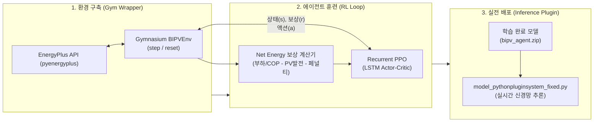

# Kinetic BIPV & Dynamic Shading 최적 제어를 위한 심층 강화학습(DRL) 구현 가이드

본 문서는 [kinetic_bipv_ai_net_energy_optimization.md](file:///c:/Users/taegyu/Codes/energyplus_project1/docs/kinetic_bipv_ai_net_energy_optimization.md)에서 설계된 **Recurrent PPO 기반 BIPV 최적 각도 제어 모델**을 실제로 구축, 학습, 배포하기 위한 상세 실무 구현 가이드입니다.

---

## 1. 전체 파이프라인 아키텍처



---

## 2. 단계별 구현 로드맵 요약

| 단계 | 주요 작업 내용 | 난이도 | 예상 소요 | 산출물 |
| :--- | :--- | :---: | :---: | :--- |
| **Phase 1** | 가상환경 의존성 설치 (`stable-baselines3`, `gymnasium` 등) | ★☆☆☆☆ | 0.5일 | 실행 환경 구성 완료 |
| **Phase 2** | EnergyPlus Gymnasium 표준 래퍼 환경(`BIPVEnv`) 클래스 작성 | ★★☆☆☆ | 2~3일 | `bipv_gym_env.py` |
| **Phase 3** | Net Energy 및 각도 전환 페널티 보상 함수 설계 | ★★☆☆☆ | 1~2일 | 보상 계산 모듈 |
| **Phase 4** | 하절기(8월) 1개월 빠른 프로토타입 학습 및 정책 거동 검증 | ★★★☆☆ | 3~4일 | 1차 학습 가중치 |
| **Phase 5** | 연간(1년) 전체 학습 및 하이퍼파라미터 튜닝 | ★★★★☆ | 1주일 | 최종 모델 `bipv_best_agent.zip` |
| **Phase 6** | EnergyPlus Plugin에 학습 모델 통합 및 실시간 추론 연동 | ★☆☆☆☆ | 1일 | AI 탑재 플러그인 완성 |
| **Phase 7** | 룰 기반 제어 대비 성능 정량 비교 및 결과 시각화 | ★★☆☆☆ | 2~3일 | 논문/보고서용 비교 그래프 |

---

## 3. 세부 단계별 구현 명세

### Phase 1: 개발 환경 및 라이브러리 구성

강화학습 표준 라이브러리와 시계열 LSTM을 지원하는 확장 패키지를 설치합니다:

```bash
# 가상환경 활성화 후 설치
uv pip install gymnasium
uv pip install torch torchvision --index-url https://download.pytorch.org/whl/cu121  # GPU 권장 (CPU는 기본 설치)
uv pip install stable-baselines3
uv pip install sb3-contrib  # RecurrentPPO (LSTM 지원) 포함
```

---

### Phase 2: EnergyPlus Gymnasium 환경 (`BIPVEnv`) 개발

표준 RL 인터페이스인 `gymnasium.Env`를 상속받아 EnergyPlus 시뮬레이션을 제어하는 래퍼 클래스를 만듭니다.

#### 1) 공간(Space) 정의
* **Observation Space (상태 공간, `Box`)**:
  - `[외기온, 풍속, 직달일사량, 산란일사량, 태양고도각, 실내온도, 내벽표면온도, PV셀표면온도, 시간(sin, cos), 직전각도]` (총 11차원)
  - *특징*: **외기 풍속**과 **PV 셀 표면온도**를 포함시켜 패널 열관성 및 대류 냉각에 따른 발전 효율 변화(Thermal Derating)를 에이전트가 직접 관측 가능.
* **Action Space (행동 공간, `Discrete(10)`)**:
  - `0`: 0° (수평 차양)
  - `1`: 10°
  - ...
  - `9`: 90° (수직 벽면)

#### 2) 핵심 메서드 구조
```python
import gymnasium as gym
from gymnasium import spaces
import numpy as np
from pyenergyplus.api import EnergyPlusAPI

class BIPVEnv(gym.Env):
    def __init__(self, idf_path, epw_path):
        super().__init__()
        # 행동 공간: 10개 각도 (0, 10, ..., 90)
        self.action_space = spaces.Discrete(10)
        self.angles = [0, 10, 20, 30, 40, 50, 60, 70, 80, 90]
        
        # 상태 공간: 11차원 연속형 변수 (PV 셀온도 및 풍속 포함)
        self.observation_space = spaces.Box(
            low=-np.inf, high=np.inf, shape=(11,), dtype=np.float32
        )
        self.last_angle = 0
        
    def reset(self, seed=None, options=None):
        # EnergyPlus 시뮬레이션을 시작 시점으로 리셋
        # 초기 상태 관측치(state) 반환
        state = self._get_initial_state()
        return state, {}

    def step(self, action):
        # 1. AI가 선택한 각도 액추에이터 주입
        target_angle = self.angles[action]
        self._set_bipv_angle(target_angle)
        
        # 2. EnergyPlus 1타임스텝(10분) 진행
        self._run_one_timestep()
        
        # 3. 새로운 관측값 및 부하/발전량 수집
        next_state = self._get_observation()
        q_cool = self._get_cooling_load()
        q_heat = self._get_heating_load()
        p_pv = self._get_pv_power()
        
        # 4. 보상 계산
        reward = self._calculate_reward(q_cool, q_heat, p_pv, target_angle)
        
        # 5. 종료 여부 (1년 완주 여부)
        terminated = self._is_done()
        self.last_angle = target_angle
        
        return next_state, reward, terminated, False, {}
```

---

### Phase 3: 보상 함수 (Reward Function) 정식화

강화학습의 성공을 결정짓는 핵심 요소입니다. **순 에너지(Net Energy) 최소화**와 **모터 마모 방지**를 동시에 만족하도록 설계합니다:

$$R_t = - \left( \frac{Q_{\text{cooling}, t}}{\text{COP}_{\text{cool}}} + \frac{Q_{\text{heating}, t}}{\text{COP}_{\text{heat}}} - P_{\text{pv}, t} \right) - w_{\text{pen}} \cdot \left| \frac{\theta_t - \theta_{t-1}}{90} \right| - P_{\text{comfort}}$$

* **단위 통일**:
  * 부하 및 발전량을 모두 전기 에너지(Watt 또는 kWh) 단위로 통일.
  * 가정: 냉방 $\text{COP} = 3.0$, 난방 $\text{COP} = 2.5$
* **헌팅 방지 페널티 ($w_{\text{pen}}$)**:
  * 10분마다 각도를 0도 $\leftrightarrow$ 90도로 급변시키는 비정상 진동을 억제 (가중치 $w_{\text{pen}} \approx 0.05 \sim 0.1 \times \text{평균 보상}$).
* **쾌적도 페널티 ($P_{\text{comfort}}$)**:
  * 실내 온도가 쾌적 범위(예: 20℃ ~ 26℃)를 크게 벗어날 경우 추가 벌점 부여.

---

### Phase 4: 프로토타입 고속 학습 (하절기 1개월)

처음부터 1년치(52,560 스텝)를 돌리면 버그 수정이나 튜닝에 시간이 너무 오래 걸립니다.

1. **IDF 시뮬레이션 기간 설정**: 8월 1일 ~ 8월 31일 (여름철 1개월)
2. **학습 실행**:
   ```python
   from sb3_contrib import RecurrentPPO
   from bipv_gym_env import BIPVEnv

   env = BIPVEnv("case1_base_august.idf", "weather.epw")
   model = RecurrentPPO(
       policy="MlpLstmPolicy",
       env=env,
       learning_rate=3e-4,
       n_steps=144,        # 1일(24h * 6스텝) 단위 버퍼
       batch_size=72,
       gamma=0.99,
       policy_kwargs=dict(lstm_hidden_size=128),
       verbose=1
   )
   model.learn(total_timesteps=4320 * 5)  # 1달(4,320 스텝)을 5회 반복 학습
   model.save("proto_august_bipv")
   ```
3. **거동 검증**: 맑은 날 정오에 차양을 눕혀 창문 일사를 차단하는지(냉방 부하 절감 지능) 확인.

---

### Phase 5: 연간 전체 학습 및 튜닝

1. **시뮬레이션 기간**: 1월 1일 ~ 12월 31일
2. **검증 포인트**:
   * **하절기**: 일사 차폐를 통한 냉방 부하 최소화
   * **동절기**: 패시브 솔라 유입을 통한 난방 부하 절감 vs PV 발전량 간의 균형 학습
   * **중간기**: 발전량 극대화 모드 동작 여부

---

### Phase 6: 실전 EnergyPlus Plugin 통합 배포

학습 완료된 신경망 가중치 파일(`bipv_best_agent.zip`)을 [model_pythonpluginsystem_fixed.py](file:///c:/Users/taegyu/Codes/energyplus_project1/model_pythonpluginsystem_fixed.py) 내부에서 로드하여 실시간 추론(Inference)합니다.

```python
# model_pythonpluginsystem_fixed.py 내부에 통합할 코드
from sb3_contrib import RecurrentPPO

class KineticBIPVPlugin(EnergyPlusPlugin):
    def __init__(self):
        super().__init__()
        # 1. 학습 완료된 PPO 에이전트 로드 (0.1초 소요)
        self.ai_model = RecurrentPPO.load("bipv_best_agent.zip")
        self.lstm_states = None
        self.last_action = 0

    def on_begin_zone_timestep_before_init_heat_balance(self, state) -> int:
        # ... (센서값 취득: out_temp, dn_rad, df_rad, sun_alt, zone_temp 등) ...
        
        # 2. 상태 벡터 구성
        obs = np.array([out_temp, dn_rad, df_rad, sun_alt, zone_temp, surf_temp, hour_sin, hour_cos, self.last_action], dtype=np.float32)
        
        # 3. AI 신경망으로 최적 각도 0.001초 만에 추론!
        action, self.lstm_states = self.ai_model.predict(
            obs, state=self.lstm_states, deterministic=True
        )
        best_angle = ANGLES[action]
        self.last_action = best_angle
        
        # 4. 액추에이터 및 스케줄 덮어쓰기
        self._override_schedules(state, optimal_angle=best_angle)
        # ... (이하 발전량 기록 로직) ...
        return 0
```

---

## 4. 성능 평가 및 검증 계획 (논문/보고서용)

동일한 기상 조건에서 다음 **4가지 제어 시나리오의 연간 에너지 수지**를 정량 비교합니다:

| 시나리오 | 제어 방식 | 설명 |
| :--- | :--- | :--- |
| **Case 0** | Base 건물 | BIPV/차양이 없는 기본 커튼월 건물 |
| **Case 1** | 고정형 BIPV (30°) | 국내 표준 최적 경사각 고정 설치 |
| **Case 2** | 현행 룰 기반 제어 | 태양 고도각 수직 추종 (현 `model_pythonpluginsystem_fixed.py`) |
| **Case 3** | **AI 최적 제어 (Recurrent PPO)** | **건물 열관성 및 Net Energy 종합 최적화 제어** |

* **평가 지표**:
  * 연간 냉방 부하 절감량 ($kWh$)
  * 연간 난방 부하 절감량 ($kWh$)
  * 연간 PV 발전량 ($kWh$)
  * **연간 순 에너지 소비량 (Net Energy, $kWh$) 및 절감률 ($\%$)**
