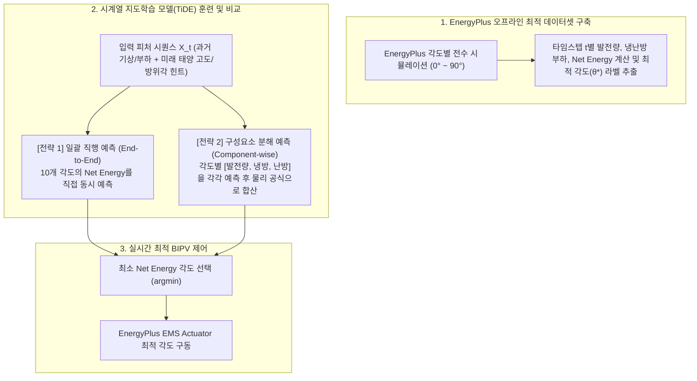

# Kinetic BIPV & Dynamic Shading 시스템의 Net Energy 최적화를 위한 시계열 지도학습(TiDE) 모델 및 예측 전략 설계안

> **✅ 모델 채택 확정 (2026-09-18)**: N-Linear / DLinear / TiDE 후보 비교 검토 결과, **TiDE(Time-series Dense Encoder)**를 최종 예측 모델로 채택하였습니다. 미래 확정 힌트(태양 고도/방위각, 시간대 인코딩)를 인코더-디코더 구조로 명시적으로 융합할 수 있다는 점이 결정적 근거이며, 이하 §2.4의 후보 비교는 채택 배경을 설명하는 참고 자료로 유지합니다. 관련 구현은 [`ai_model/tide_model.py`](file:///c:/Users/taegyu/Codes/energyplus_project1/ai_model/tide_model.py), [`ai_model/train_tide.py`](file:///c:/Users/taegyu/Codes/energyplus_project1/ai_model/train_tide.py)에 진행 중이며 현재 **전략 1(End-to-End)** 체크포인트(`ai_model/checkpoints/tide_strategy1_best.pt`)까지 학습 완료된 상태입니다.

## 1. 개요 및 문제 정의 (Background & Problem Formulation)

### 1.1 현행 룰 기반 제어의 한계

현재 [model_pythonpluginsystem_fixed.py](file:///c:/Users/taegyu/Codes/energyplus_project1/model_pythonpluginsystem_fixed.py)에서는 태양 고도각에 맞춰 PV 패널 각도를 수직 추종($\text{Angle} \approx \text{Sun Altitude}$)하는 휴리스틱 제어를 수행하고 있습니다.

- **한계점**: 이 방식은 **PV 발전량 극대화**에는 유리하나, PV 모듈이 창호 상부/외측에서 수행하는 **동적 차양(Dynamic Shading)** 역할과 **PV 모듈 자체의 열적 거동(Thermal Dynamics)**을 반영하지 못합니다.
- **상충 관계 (Trade-off) 및 복합 열역학적 거동**:
  - **여름철 (냉방 부하 우세)**: PV를 세워 발전량을 높이는 것보다, 차양을 눕혀 직달일사 유입(Solar Heat Gain)을 차단하는 것이 냉방 부하를 훨씬 크게 줄일 수 있습니다.
  - **겨울철 (난방 부하 우세)**: 발전을 포기하더라도 일사를 창호 내부로 적극 투과시켜 패시브 솔라(Passive Solar) 열획득을 얻는 것이 실내 난방 부하 절감에 유리할 수 있습니다.
  - **다중 열관성(Multi-timescale Thermal Inertia)**:
    1. **건물 구체 및 실내 공기 열관성 (장기 시상수 $\tau_{\text{bldg}} \approx 2 \sim 6\text{시간}$)**: 외피 및 실내 공기의 축열 효과로 인해 현재의 차양 각도 결정이 수 시간 뒤의 냉난방 부하에 영향을 미칩니다.
    2. **PV 패널 열관성 및 온도 의존적 효율 (단기 시상수 $\tau_{\text{pv}} \approx 10 \sim 30\text{분}$)**:
       - 현재 모델(`PhotovoltaicPerformance:EquivalentOne-Diode`)에는 모듈 열용량(`Total Heat Capacity = 50,000 J/m²-K`) 및 음의 전압/출력 온도계수($\mu_{Voc} = -0.1399 \text{ V/K}$, 출력 기준 약 $-0.35 \sim -0.4\%/\text{K}$)가 설정되어 있습니다.
       - 일사를 집중 추종할 경우 단기 발전량은 증가하지만, **패널 열관성에 의해 셀 온도($T_{\text{cell}}$)가 $50 \sim 65^\circ\text{C}$ 이상으로 점진적 상승하여 발전 효율이 급격히 저하(Thermal Derating)**됩니다.
       - 풍속에 따른 대류 냉각 및 일시적 차양 각도 조절을 통해 셀 온도를 낮추면 발전 효율이 복원되는 동적 상관관계가 존재합니다.

### 1.2 최적화 목적 함수 (Net Energy Formulation)

타임스텝 $t$에서의 순 에너지 소비(Net Energy Consumption)를 최소화하는 것을 목표로 합니다:

$$\min_{\theta_t \in \mathcal{A}} \sum_{t=1}^{T} \text{Net Energy}_t$$

$$\text{Net Energy}_t = \left( \frac{Q_{\text{cooling}, t}}{\text{COP}_{\text{cool}}} + \frac{Q_{\text{heating}, t}}{\text{COP}_{\text{heat}}} \right) - P_{\text{pv}, t}(T_{\text{cell}, t}, \theta_t)$$

- $Q_{\text{cooling}, t}, Q_{\text{heating}, t}$: 타임스텝 $t$에서의 실내 냉방 및 난방 열부하 ($\text{W}$ 또는 $\text{kWh}$)
- $\text{COP}_{\text{cool}}, \text{COP}_{\text{heat}}$: 냉난방 시스템의 성능 계수 (열부하를 전력 소비량으로 환산)
- $P_{\text{pv}, t}(T_{\text{cell}, t}, \theta_t)$: 타임스텝 $t$에서의 BIPV 발전 전력 ($\text{W}$). **PV 셀 온도($T_{\text{cell}}$) 및 입사 일사량의 함수로 비선형 derating 반영**
- $\theta_t$: BIPV 틸트 각도 제어 변수 ($\mathcal{A} = \{0^\circ, 10^\circ, 20^\circ, \dots, 90^\circ\}$)

---

## 2. AI 접근 전략 전환: 지도학습(Supervised Learning) 기반 최적화

기존의 강화학습(RL) 방식 대신 **지도학습(Supervised Learning)**을 핵심 방법론으로 채택합니다.

### 2.1 지도학습 전환 배경 및 당위성
1. **EnergyPlus를 통한 명확한 정답 데이터(Ground Truth) 생성 가능**:
   - BIPV 각도 후보군이 이산적($\mathcal{A} = \{0^\circ, 10^\circ, \dots, 90^\circ\}$, 총 10개)이므로, EnergyPlus 오프라인 전수 시뮬레이션을 통해 각 타임스텝별로 Net Energy를 최소화하는 **최적 각도($\theta^*$) 레이블**을 사전에 정확히 추출할 수 있습니다.
2. **시계열 특화 모델(DLinear, N-Linear, TiDE 등)과의 최적 적합성**:
   - DLinear, N-Linear, TiDE 등 최신 시계열 신경망은 본래 **지도학습 기반의 시퀀스 예측(Time-Series Forecasting/Representation)**에 최적화되어 설계되었습니다.
   - 복잡한 RL 정책망(Actor-Critic)으로의 억지 결합 없이, 모델 본연의 시계열 추세·계절성 분해 성능을 100% 활용할 수 있습니다.
3. **학습 안정성 및 개발 생산성**:
   - 강화학습의 치명적 병목인 느린 시뮬레이션 반복 속도(샘플 비효율성), 보상 튜닝의 난해함, 수렴 불안정성 문제를 원천 배제하고, 표준 머신러닝 파이프라인(Train/Val/Test 분할, 명확한 Loss 모니터링)으로 신속한 연구 개발이 가능합니다.

### 2.2 입력 피처 구성 ($X_{t-L:t}$)
과거 $L$ 타임스텝의 시계열 윈도우(Lookback Window) 및 미래 $H$ 스텝의 확정 힌트(Known Future)를 활용합니다. 아래는 [`data_preprocessing/build_case2_ks_tide_dataset.py`](file:///c:/Users/taegyu/Codes/energyplus_project1/data_preprocessing/build_case2_ks_tide_dataset.py)로 구축한 `data/case2_ks_bipv_tide_dataset.csv` 기준 **현재 구현 확정 스키마**입니다:
1. **미래 확정 힌트 (Known Future Covariates, $t \sim t+H$)** — `FUTURE_COV_COLS`:
   - 태양 고도각(`sun_altitude`), 태양 방위각(`sun_azimuth`) (천문학적 기하 정보)
   - 시간(`hour_sin`, `hour_cos`), 월(`month_sin`, `month_cos`) 삼각함수 인코딩
2. **과거 관측 시계열 (Past Covariates, $t-L \sim t$)** — `PAST_COV_COLS`:
   - 외기온도(`outdoor_temp`), 직달일사량(`direct_solar`), 산란일사량(`diffuse_solar`)
3. **룩백 타겟 (Lookback Targets)**: 각도별 Net Energy(전략 1) 또는 [발전량, 냉방부하, 난방부하](전략 2) 자체 이력을 룩백 윈도우로 함께 입력하여 건물 축열 및 열관성을 모델이 스스로 학습하도록 함.

> **비고**: 초기 설계안에 포함되었던 상대습도($RH$), 외기 풍속($v_{\text{wind}}$)은 1차 구현에서는 제외되었습니다(PV 셀 온도 기반 derating이 이미 direct/diffuse 일사량과 외기온도로 충분히 근사되는지 검증 후, 필요 시 후속 실험에서 추가 예정).

### 2.3 지도학습 타겟 및 예측 전략 (핵심 비교 실험)

TiDE 모델의 다변량 예측 강점을 살려, **"한 번에 Net Energy를 바로 예측하는 방식"**과 **"물리 구성요소를 각각 예측한 뒤 사후 계산하는 방식"**의 2대 전략을 상호 비교 검증합니다.

| 비교 항목 | [전략 1] 일괄 직행 예측 (End-to-End) | [전략 2] 구성요소 분해 예측 (Component-wise) |
| :--- | :--- | :--- |
| **모델 출력 (Target)** | 각도별 $\widehat{\text{Net Energy}}_{0 \sim 90}$ (10개) 직접 출력 | 각도별 $[\widehat{P}_{\text{pv}}, \widehat{Q}_{\text{cool}}, \widehat{Q}_{\text{heat}}]_{0 \sim 90}$ (총 30개) 동시 출력 |
| **최종 Net Energy 도출** | 모델의 출력을 그대로 사용 | 모델 예측치를 물리 공식($\frac{\widehat{Q}_{\text{cool}}}{\text{COP}_{\text{cool}}} + \dots - \widehat{P}_{\text{pv}}$)에 대입 |
| **학습 용이성** | 타겟 수가 적고 구조가 직관적 | 발전(일사 의존)과 냉난방(외기온 의존)의 물리적 인과관계가 명확해 신경망 학습이 용이 |
| **해석 가능성 (설명력)** | 순 에너지 수치만 파악 가능 | 각도별 발전량과 냉방부하의 구체적 기여도를 분리하여 검증 가능 (학술적 설득력 우수) |
| **시스템 변경 유연성** | COP 사양 변경 시 모델 전체 재학습 필요 | **COP가 바뀌어도 공식 분모만 변경하면 재학습 없이 즉시 대응 가능** |

### 2.4 주요 시계열 지도학습 후보 모델 비교 및 TiDE 채택 근거 (쉬운 개념 설명)

> **💡 중학생도 이해할 수 있는 쉬운 비유와 핵심 요약**

#### 1) N-Linear (영점 조절 후 직선을 긋는 모델)
* **쉬운 비유**: **"체중계 영점 조절 후 키/몸무게 변화만 재는 모델"**
* **동작 원리**: 
  - 기온이나 일사량은 계절에 따라 전체적인 높낮이가 널뛰기합니다. (예: 여름엔 30℃ 근처에서 왔다 갔다 하고, 겨울엔 영하 5℃ 근처에서 왔다 갔다 함)
  - 인공지능이 이렇게 큰 숫자 차이 때문에 헷갈리지 않도록, **"가장 최근의 값(마지막 데이터)"을 빼서 기준점을 0으로 똑같이 맞춘(정규화, Normalization)** 뒤에, 아주 단순한 **1차 직선(선형 계산)**으로 미래를 예측합니다. 그리고 마지막에 아까 뺐던 기준값을 다시 쏙 더해줍니다.
* **장점**: 수식이 깃털처럼 단순한데도, 날씨나 계절이 확 바뀔 때 기준점이 흔들려 엉뚱한 예측을 하는 실수를 완벽하게 막아줍니다.

#### 2) DLinear (큰 흐름과 반복 패턴을 따로따로 분해하는 모델)
* **쉬운 비유**: **"요리할 때 '고기(큰 덩어리)'와 '양념(반복 패턴)'을 분리해서 맛보는 셰프"**
* **동작 원리**: 
  - 태양광과 날씨 데이터 속에는 항상 2가지가 뒤섞여 있습니다:
    1. **트렌드(추세)**: 계절이 바뀌며 기온이 서서히 오르내리는 '큰 흐름'
    2. **시즈널리티(주기)**: 낮에는 해가 뜨고 밤에는 해가 지는 '24시간 반복 규칙'
  - 이 둘을 한꺼번에 배우면 인공지능이 혼란스러워합니다. DLinear는 데이터를 칼로 쪼개듯 **'큰 흐름'과 '24시간 반복 패턴' 2개로 깔끔하게 분해(Decomposition)**합니다.
  - 그런 다음 각각에 대해 단순한 계산을 따로 수행하고, 마지막에 둘을 다시 합쳐서 정답을 냅니다.
* **장점**: 하루 주기(낮/밤)가 매우 뚜렷한 태양광 일사량과 기온 데이터를 학습할 때 트랜스포머 같은 복잡한 모델보다 훨씬 빠르고 정확합니다.

#### 3) TiDE (시간표와 힌트를 꼼꼼히 모아보는 모범생 모델)
* **쉬운 비유**: **"과거 시험 성적뿐만 아니라 '시험 시간표와 날씨 예보'까지 챙겨보는 모범생"**
* **동작 원리**: 
  - DLinear나 N-Linear는 주로 "과거의 발전량/온도 숫자" 자체만 봅니다. 하지만 현실에서는 **"앞으로 몇 시가 될지(태양 고도)", "내일 날씨 예보가 어떤지", "주말인지 평일인지" 같은 미래의 주변 힌트(미래 공변량, Future Covariates)**가 매우 중요합니다.
  - 구글(Google)에서 개발한 TiDE는 무겁고 느린 트랜스포머 대신, 가장 튼튼하고 빠른 기본 신경망(MLP)들을 블록처럼 탄탄하게 쌓아 올렸습니다.
  - 과거 데이터뿐 아니라 **태양 위치, 미래 시간대 등의 다양한 주변 힌트들을 한 번에 요약(인코딩)한 뒤, 미래의 에너지와 최적 각도를 똑똑하게 계산(디코딩)**해냅니다.
* **장점**: 기상 센서값 외에도 태양 궤적, 시간대 등 다양한 힌트 변수들을 다각도로 함께 고려해야 하는 건물 BIPV 시스템에 가장 적합한 완성형 모델입니다.

| 모델 | 핵심 기법 | 쉬운 비유 | BIPV 적용 시 강점 |
| :--- | :--- | :--- | :--- |
| **N-Linear** | 영점 조절 (최근값 빼고 더하기) | 체중계 영점 조절 | 계절/날씨 급변 시 기준점 왜곡 방지 |
| **DLinear** | 추세 + 주기 분해 | 고기와 양념 따로 맛보기 | 낮/밤 24시간 일사 주기 패턴 분리에 최강 |
| **TiDE** | 주변 힌트(공변량) 융합 인코더 | 시간표와 힌트를 다 챙기는 모범생 | 태양 위치, 시간대 등 다양한 기상 변수 동시 처리 |

---

## 3. 단계별 구현 및 연구 로드맵

1. **1단계: 데이터 인터페이스 및 정량 지표 정의 (Data & Metrics)** — ✅ 완료
   - 냉난방 부하 변수 핸들([`Zone Ideal Loads Supply Air Total Cooling/Heating Energy`](file:///c:/Users/taegyu/Codes/energyplus_project1/model_pythonpluginsystem_fixed.py)) 추출
   - PV 셀 온도 핸들(`Generator Photovoltaic Cell Temperature`) 및 풍속 핸들(`Site Wind Speed`) 추출
   - COP 기준값 설정 (냉방 $\text{COP}=3.0$, 난방 $\text{COP}=2.5$ 등)
2. **2단계: 기준선(Baseline) 성능 데이터 도출**
   - 현행 태양 추종 룰 제어(`model_pythonpluginsystem_fixed.py`)의 연간 Net Energy 산출
   - 고정각(30° 등) 제어 대비 에너지 절감량 및 하절기 셀 과열 손실 베이스라인 확보
3. **3단계: 통합 데이터셋 구축 및 예측 전략별 TiDE 모델 훈련** — 🔶 진행 중 (전략 1 완료, 전략 2 예정)
   - ✅ EnergyPlus `case2_KS` 각도별($0^\circ \sim 90^\circ$) 전수 시뮬레이션 결과로부터 기상, 태양 기하, 각도별 $[P_{\text{pv}}, Q_{\text{cool}}, Q_{\text{heat}}, \text{Net Energy}]$, 최적 각도 $\theta^*$를 모두 포함하는 통합 CSV 데이터셋 구축 완료 ([`data_preprocessing/build_case2_ks_tide_dataset.py`](file:///c:/Users/taegyu/Codes/energyplus_project1/data_preprocessing/build_case2_ks_tide_dataset.py) → `data/case2_ks_bipv_tide_dataset.csv`, [`data_preprocessing/split_case2_ks_dataset.py`](file:///c:/Users/taegyu/Codes/energyplus_project1/data_preprocessing/split_case2_ks_dataset.py) → `case2_ks_{train,val,test}.csv`)
   - ✅ **전략 1(일괄 직행 예측)** TiDE 모델 구현 및 1차 학습 완료 ([`ai_model/tide_model.py`](file:///c:/Users/taegyu/Codes/energyplus_project1/ai_model/tide_model.py), [`ai_model/train_tide.py`](file:///c:/Users/taegyu/Codes/energyplus_project1/ai_model/train_tide.py) → `ai_model/checkpoints/tide_strategy1_best.pt`)
   - ⬜ **전략 2(구성요소 분해 예측 후 합산)** 모델 학습 (`train_tide.py --strategy 2`)
   - ⬜ 전략 1 vs 전략 2 예측 오차(MAE/RMSE), R² 정량 비교 평가 스크립트 작성 및 결과 산출 (test set 기준)
4. **4단계: 폐루프(Closed-loop) 제어 통합 및 성능 검증**
   - 최적 전략으로 선정된 TiDE 모델을 EnergyPlus Python 플러그인/API 제어 루프에 이식
   - 룰 기반 추종 제어 대비 Net Energy 절감률, 하절기 실내 냉방부하 차단 효과 및 PV 과열 완화 성능 종합 비교 검증

